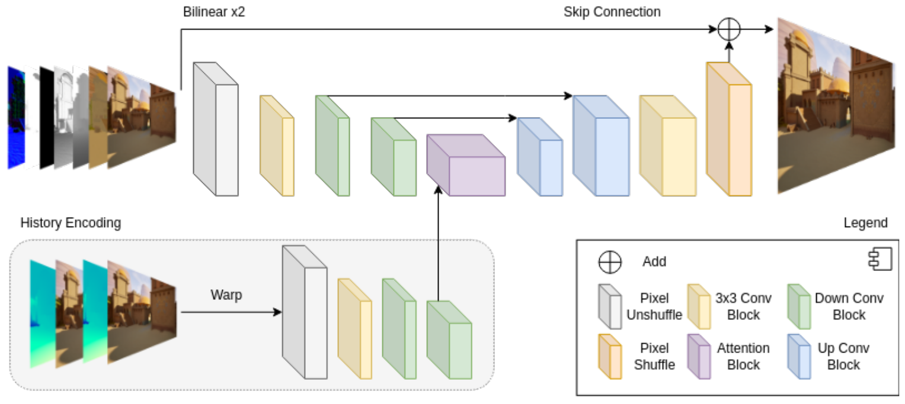

# Real-Time Rendering Super Resolution with Unreal Engine 5

## Abstract

Real-time rendering super resolution describes the process 
of increasing the resolution and improving the image quality of real-time rendered content before displaying it to a user.
In contrast to images or videos used for super resolution tasks, real-time rendered content suffers 
from additional artifacts in form of aliasing, dithering and detail loss.
In addition to the rendered frame, real-time rendering also provides access to auxiliary buffer data called G-buffers.
In this work, we investigate the restrictive use case of increasing the resolution of rendered content from 1080p
to 4k while improving its quality 60 times per second.
Therefore, we created our own dataset within Unreal Engine 5, 
containing stylized environments with fully animated characters.
We call it Unreal Stylized Motion Matching, or USMM.
In addition we provide a custom plugin to get G-buffer information as well as different resolutions from any Unreal Engine project.
We trained a neural method called Unreal Real-Time Super Resolution, or URTSR, 
with our dataset to learn to mitigate the problems of real-time rendered content.
Our URTSR method is capable of increasing the resolution to 4k in a real gaming context, while also achieving respectable image quality.
Yet, our method is not capable to utilize all the provided G-buffer information effectively.
We believe further investigations in regard to the additional information could improve the effectiveness of neural methods for our restrictive use case.

## Main Contributions

- Generating a 4k RRSR dataset, called USMM, containing 16800 (LR, HR) frame pairs, including 4k anti-aliased HR frames and 540p and 1080p aliased LR frames within Unreal Engine 5.4
- Providing a custom plugin for generating (LR, HR) frame pairs with auxiliary buffers in any Unreal Engine 5 project.
- Designing our URTSR network for RRSR capable of upsampling from 1080p to 4k in a 60 fps setting.

## Related Work
We compare our method with:
- Bilinear
- Bicubic
- [RTSRN](https://github.com/eduardzamfir/RT4KSR)
- [STSS](https://github.com/ryanhe312/STSSNet-AAAI2024/tree/main)
- [NSRRD](https://github.com/Riga2/NSRD)

## Dataset Generation

We used Unreal Engine 5.4 for generating our (LR, HR) frame pairs with auxiliary buffer information.
For more information please checkout [https://gitlab.informatik.uni-wuerzburg.de/Brandner/generate_ue_stylized_data](https://gitlab.informatik.uni-wuerzburg.de/Brandner/generate_ue_stylized_data)

An example frame pair looks like this:

## Network Design

Our neural method is called Unreal Real-Time Super Resolution (URTSR).
URTSR is a shallow U-Net architecture with an attention mechanism in its bottom layer.
The attention mechanism is convolution based version of the famous multi-head attention block proposed in
the Convolutional Visual Transformer (CvT).

In addition to the LR frame, we utilize G-buffer information, as well as previous frames warped through motion vectors to the current point in time.

## Evaluation

We share some results on the objective metrics PSNR, SSIM and LPIPS

Show an example result image here!

## Code Frameworks
We took some inspiration from the code base of [BasicSR](https://github.com/XPixelGroup/BasicSR).
