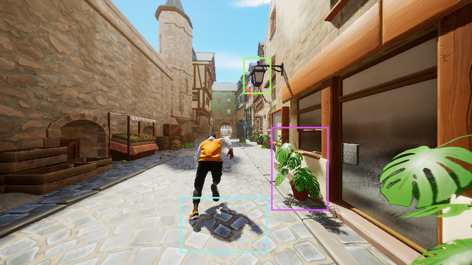
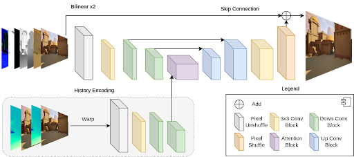
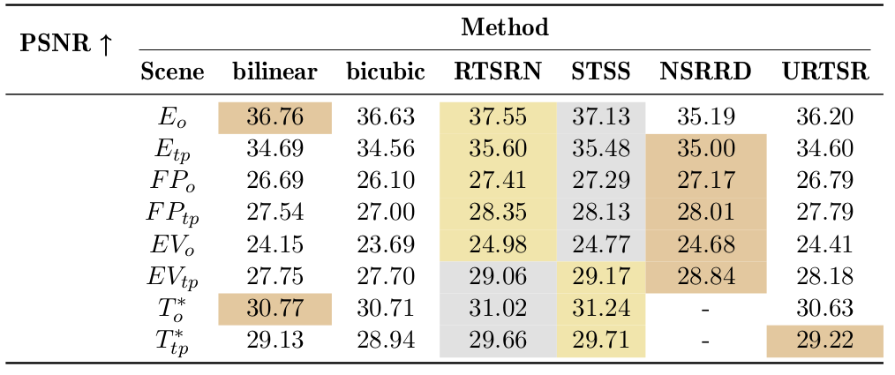
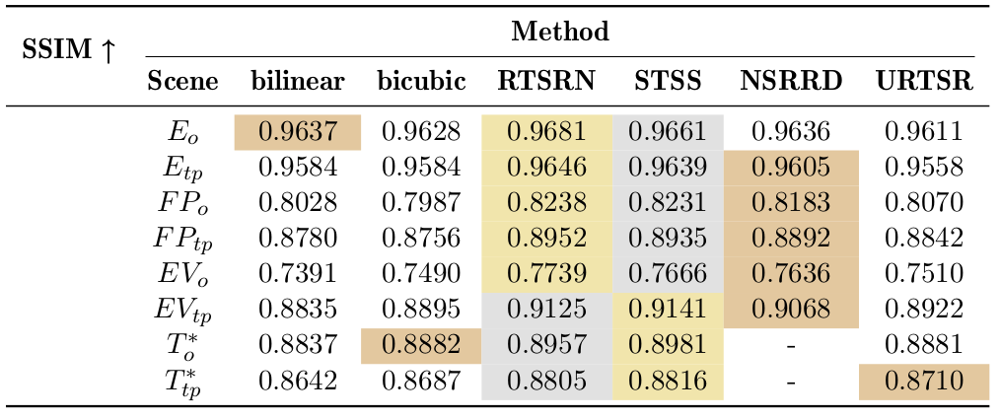
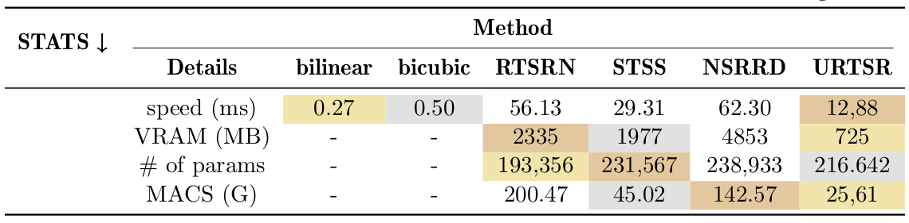

# Real-Time Rendering Super Resolution with Unreal Engine 5

This repository contains the code for my master thesis Real-Time Rendering Super Resolution with Unreal Engine 5.
We focus on highly efficient neural upsampling from 1080p to 4K in a gaming context of 60 frames per second for real-time rendered content.

https://github.com/user-attachments/assets/5c55b7ce-e0a3-43f7-9d67-bc5732e01565

The example showcases 540p upscaled with our URTSR method to 4K, a times 4 upscaling. (This illustrates the difference more clearly.) 

## Abstract

Real-time rendering super resolution describes the process 
of increasing the resolution and improving the image quality of real-time rendered content before displaying it to a user.
In contrast to images or videos used for super resolution tasks, real-time rendered content suffers 
from additional artifacts in form of aliasing, dithering and detail loss.
In addition to the rendered frame, real-time rendering also provides access to auxiliary buffer data called G-buffers.
In this work, we investigate the restrictive use case of increasing the resolution of rendered content from 1080p
to 4K while improving its quality 60 times per second.
Therefore, we created our own dataset within Unreal Engine 5, 
containing stylized environments with fully animated characters.
We call it Unreal Stylized Motion Matching, or USMM.
In addition we provide a custom plugin to get G-buffer information as well as different resolutions from any Unreal Engine project.
We trained a neural method called Unreal Real-Time Super Resolution, or URTSR, 
with our dataset to learn to mitigate the problems of real-time rendered content.
Our URTSR method is capable of increasing the resolution to 4K in a real gaming context, while also achieving respectable image quality.
Yet, our method is not capable to utilize all the provided G-buffer information effectively.
We believe further investigations in regard to the additional information could improve the effectiveness of neural methods for our restrictive use case.

## Main Contributions

- Generating a 4K RRSR dataset, called USMM, containing 16800 (LR, HR) frame pairs, including 4K anti-aliased HR frames and 540p and 1080p aliased LR frames within Unreal Engine 5.4
- Providing a custom plugin for generating (LR, HR) frame pairs with auxiliary buffers in any Unreal Engine 5 project.
- Designing our URTSR network for RRSR capable of upsampling from 1080p to 4K in a 60 fps setting.

## Problem Statement

Mitigating rendering artifacts:
- aliasing (green)
- dithering (blue)
- detail loss (purple)

## Dataset Generation - USMM

We used Unreal Engine 5.4 for generating our Unreal Stylized Motion Matching (**USMM**) dataset.
The dataset contains 4 different environments each with two different sequences (overview = _o, third person = _tp), resulting in 8 sequences:
- Egypt = E -> E_o, E_tp
- Fantasy Provencal = FP -> FP_o, FP_tp
- Eastern Village = EV -> EV_o, EV_tp
- Town = T -> T_o, T_tp

In total we created 16800 (LR, HR) frame pairs, with 540p and 1080p as low resolution (LR) and 4K as groundtruth high resolution (HR) images.

An example of how such a frame pair looks like can be seen here:

The repository containing the Unreal project used for generating the dataset can be found at [https://gitlab.informatik.uni-wuerzburg.de/Brandner/generate_ue_stylized_data](https://gitlab.informatik.uni-wuerzburg.de/Brandner/generate_ue_stylized_data)

### Using the Generate Data plugin

While I can not provide my dataset for training my models (as it is 550 GB of data and property of the university), I can provide a plugin to generate data usable for RRSR.
Unzip the GenerateData.zip file and put it under the Plugins folder of your Unreal Engine 5 project (if the project does not contain any plugins, generate the Plugins folder).
The plugin contains the shaders we used to extract the G-Buffer information from the engine, as well as configuration files we used for the [Movie Render Queue (MRQ)](https://dev.epicgames.com/documentation/en-us/unreal-engine/render-cinematics-in-unreal-engine?application_version=5.4).
The Movie Render Queue allows us to render any Unreal Engine sequence's frames into seperate .png (and .exr for the motion vectors) files. 

The generating process looks roughly like this:

A step-by-step guide can be found in the appendix of my thesis.pdf

## Network Design - URTSR

Our neural method is called Unreal Real-Time Super Resolution (**URTSR**).
URTSR is a shallow U-Net architecture with an attention mechanism in its bottom layer.
The attention mechanism is convolution based version of the famous multi-head attention block proposed in
the Convolutional Visual Transformer (CvT).

In addition to the LR frame, we utilize G-buffer information, as well as previous frames warped through motion vectors to the current point in time.

## Related Work
We compare our method with:
- Bilinear
- Bicubic
- [RTSRN](https://github.com/eduardzamfir/RT4KSR)
- [STSS](https://github.com/ryanhe312/STSSNet-AAAI2024/tree/main)
- [NSRRD](https://github.com/Riga2/NSRD)

## Evaluation

We evaluate our network URTSR on our USMM dataset withing the 4 enviroments and resulting 8 sequences.

### PSNR

Peak signal-to-noise ratio (PSNR) expresses the error between the original and upsampled image in decibel (dB), on a logarithmic scale.
The error is computed based on mean squarred error (MSE).

### SSIM

Structural Similiarity index measurement (SSIM) measures the difference between the original and upsampled image by changes in luminance, contrast and structure.

### LPIPS

Learned perceptual image patch similiarity (LPIPS) is an unreasonably effective machine learning based approach of identifying perceived image quality.

### STATS

The statistics include inference speed (no backpropagation) in miliseconds, VRAM usage in megabyte, number of parameters and multiply-addition operations.
All statistics were recorded with system with Intel i7 14700kf and RTX 4080.

### Results

Our neural method URTSR outperforms interpolation techniques in LPIPS and is roughly on pair in regards to PSNR and SSIM.
Regarding our system specifications URTSR is the only method capable of upsampling 1080p input to 4K in a 60 fps gaming context.

Let's look at an image comparison:

A video comparison can be found at videos/URTSR.mp4.

## Code Frameworks
We took some inspiration from the code base of [BasicSR](https://github.com/XPixelGroup/BasicSR).

## More Information

Please check out my thesis for more detailed information about this project.
